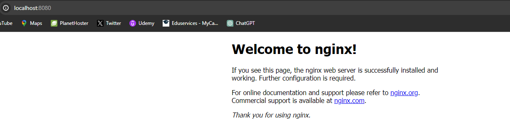
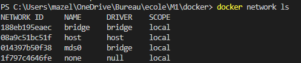
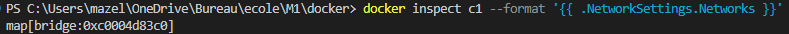

# DOCKER MDS - MAZEL Florian

### - Faites une recherche sur les différents avantages qu’apporte la conteneurisation et essayé d’expliquer les grands principes avec vos mots

La conteneurisation permet de créer des applications plus rapidement et plus sécurisées.
Isolés du système d'exploitation hôte, ils peuvent avoir leur propre bibliothèques et dépendances, ce qui permet d'avoir moins de conflit.
Les conteneurs utilisent moins de ressources que les machines virtuelles car ils partagent le même système d'exploitation hôte.
Les conteneurs garantissent que l'environnement de développement, de test et de production est le même, ce qui réduit les problèmes de "ça marchait sur ma machine".

### - Faites un schéma comparatif entre une VM et un conteneur (il y en a énormément sur Internet) et expliquez le avec vos mots


**Isolation :** Les VM offrent une isolation complète au niveau de l'OS, tandis que les conteneurs partagent l'OS de l'hôte.
**Utilisation des ressources :** Les conteneurs sont plus économes en ressources car ils partagent l'OS et démarrent plus rapidement, tandis que les VM nécessitent plus de ressources et prennent plus de temps à démarrer à cause de la nécessité de charger un OS complet.
**Portabilité :** Les conteneurs sont souvent considérés comme plus portables entre les environnements car ils encapsulent tout le nécessaire pour exécuter l'application.
**Sécurité :** Les VM peuvent offrir une meilleure sécurité grâce à une isolation plus stricte, mais cela dépend des besoins spécifiques et de la configuration de la sécurité.

Concrètement, les conteneurs sont généralement préférés pour des déploiements plus rapides et économes, tandis que les VM sont utilisées lorsque l'isolation complète est une priorité.


### - Faites une liste des différentes commandes Docker et expliquer ce qu'elles font avec vos mots

+ **docker run :** Lance un conteneur Docker à partir d'une image. 

+ **docker build :** Construit une image Docker à partir d'un Dockerfile. C'est utile pour créer des environnements personnalisés.

+ **docker pull :** Télécharge une image Docker depuis un registre, comme Docker Hub.

+ **docker push :** Envoie une image Docker vers un registre. Utile pour partager des images personnalisées.

+ **docker images :** Affiche les images Docker localement stockées sur une machine.

+ **docker ps :** Affiche les conteneurs actuellement en cours d'exécution.

+ **docker stop :** Arrête un ou plusieurs conteneurs en cours d'exécution.

+ **docker start :** Démarre un ou plusieurs conteneurs arrêtés.

+ **docker rm :** Supprime un ou plusieurs conteneurs. Cela n'affecte pas les images.

+ **docker rmi :** Supprime une ou plusieurs images Docker. Cela ne supprime pas les conteneurs qui utilisent ces images.

+ **docker network :** Gère les réseaux Docker. On peut créer, lister et supprimer des réseaux.

+ **docker volume :** Gère les volumes Docker. Les volumes sont utilisés pour la persistance des données.

### - Un screen prouvant que votre application fonctionne




### - Un recapitulatif des lignes de commandes utilisées   

+ docker pull nginx
+ docker run -d -p 8080:80 nginx

### - Avoir une base de données qui tourne sur le port 3306 avec des données persistantes

Commande exécutée :

```docker run --name mariadb-test -v mariadb-data:/var/lib/mysql -e MYSQL_ROOT_PASSWORD= -e MYSQL_DATABASE=databaseshugo -e MYSQL_USER=root -e MYSQL_PASSWORD= -p 3306:3306 -d mariadb```

### - Expliquer le principe de volume Docker et son utilité

Les volumes Docker sont essentiels pour gérer les données de manière efficace, sécurisée et performante. Ils assurent la persistance, la sécurité et la flexibilité dans la gestion des données, tout en permettant une séparation claire entre les données et les applications.

### - Quelle est la différence entre une application statefull et stateless ?

Une application stateful garde une trace de l'état ou des interactions précédentes, nécessitant un stockage persistant, alors qu'une application stateless traite chaque requête de manière indépendante, sans avoir besoin de stockage persistant pour maintenir des informations d'état.


### - Faites une recherche sur les différents mode de réseau (Liste + Explication)

+ **Bridge :** C'est le mode de réseau par défaut pour les conteneurs Docker. Docker crée un réseau pont virtuel sur l'hôte. Chaque conteneur connecté à ce réseau reçoit une adresse IP privée. Docker fait office de passerelle pour les conteneurs, leur permettant de communiquer avec l'extérieur.
+ **Host :** Dans ce mode, le conteneur partage l'espace de noms réseau de l'hôte. Cela signifie que le conteneur ne reçoit pas sa propre adresse IP. Au lieu de cela, il utilise directement le réseau de l'hôte. Ce mode est souvent utilisé pour des performances réseau optimisées.
+ **None :** Ici, le conteneur n'a aucun réseau actif. Il est complètement isolé et n'a pas d'accès réseau, sauf s'il est configuré manuellement.
+ **Overlay :** Ce mode est utilisé dans les environnements Docker Swarm pour permettre la communication entre les conteneurs s'exécutant sur différents nœuds du Swarm. Il crée un réseau de superposition qui relie plusieurs hôtes Docker.
+ **Macvlan :** Le mode Macvlan permet aux conteneurs d'avoir une adresse MAC unique, leur permettant d'apparaître comme des périphériques physiques sur le réseau. Cela est utile pour les cas où les conteneurs doivent être intégrés dans des réseaux existants avec des politiques spécifiques.

### - Quels sont les modes de réseaux les plus courament utilisé ? 

Les modes de réseaux les plus utilisés sont : 
+ Bridge
+ Host

### - Lancer un conteneur qui utilise l'image nginx:latest. En utilisant les commandes adéquates, vous devez trouver :

### - La liste des réseaux docker sur votre machine 



### - A quel réseau appartient ce conteneur


