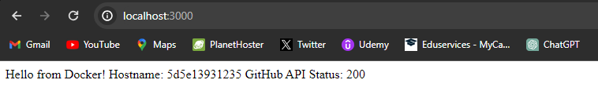
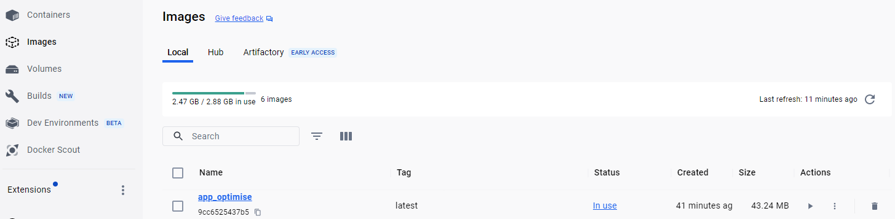
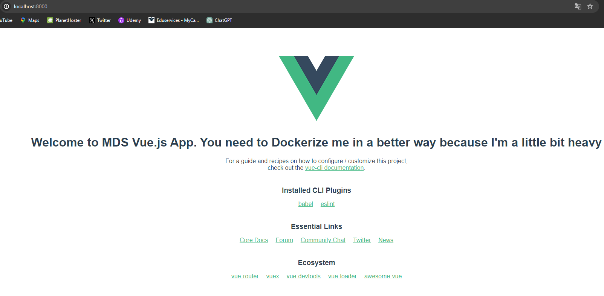
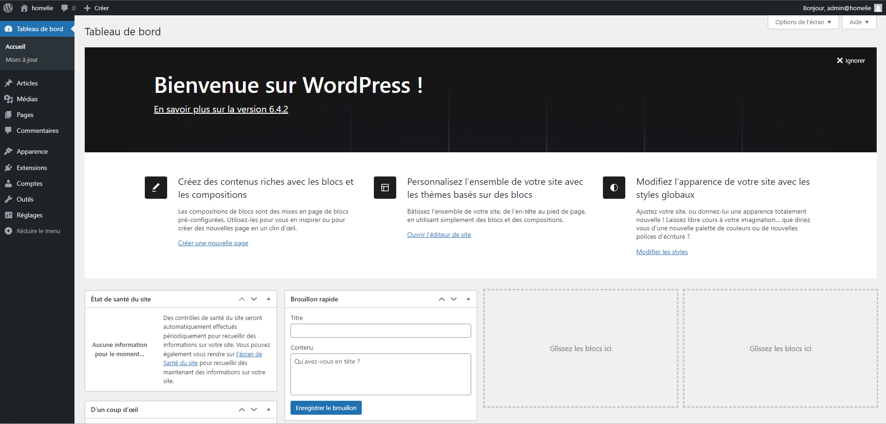

## Ecrire son image Docker

### - Avoir une application fonctionnelle sur le port de votre choix et le montrer à votre formatteur



**URL DU GIT :** https://github.com/MAZEL-Florian/docker-create-image

**Réalisation de l'application**

+ Créer un fichier "Dockerfile" pour la création de l’image avec les étapes suivantes :
```
- Utiliser une image de base officielle de Node.js
- Définir le répertoire de travail dans le conteneur
- Copier les fichiers de dépendances
- Installer les dépendances
- Copier tous les fichiers du projet dans le conteneur
- Exposer le port sur lequel l'application va tourner
- Commande pour démarrer l'application
```

+ Créer un fichier "docker-compose.yml" avec le contenu suivant :
```
version: '3'
services:
  web:
    build: .
    ports:
      - "3000:3000"

```

+ Dans le terminal, il ne reste plus qu'à exécuter les commandes suivantes :
``` docker-compose build ```
``` docker-compose up ```


### - Avoir une image la plus légère possible. A titre indicatif, celle de votre formateur fait 44.1MB.






**Etapes pour optimiser cette image :**

Il me suffisait seulement d'éditer le fichier Dockerfile et de mettre le code suivant :

```
FROM node:alpine as build-stage
WORKDIR /app
COPY package*.json ./
RUN npm install
COPY . .
RUN npm run build
FROM nginx:alpine
COPY --from=build-stage /app/dist /usr/share/nginx/html
EXPOSE 8000
CMD ["nginx", "-g", "daemon off;"]
```

+ J'ai changé la base image de 'latest' à 'alpine' car elle est plus petite et sécurisée.
+ Dans l'ancien code, la construction et l'exécution étaient dans la même image, j'ai fais un multi-stage build afin d'intégrer seulement les fichiers nécessaires dans l'image finale.

Une fois cela réalisé, j'ai effectué les commandes suivantes :

```
docker build -t app_optimise .
docker run -p 8000:80 app_optimise
```

Git du projet :
```
https://github.com/MAZEL-Florian/docker-optimize-image.git
```

### Stack multi-service




### - Comment configurez-vous les variables d’environnement?

J'ai configuré les variables d'environnement avec la syntaxe ${variable} pour les mots de passe en les stockant dans un .env afin de sécuriser les données sensibles.

### - Comment l’application wordpress communique-t-elle avec le conteneur MariaDB ?

Les deux services sont déployés sur le même réseau Docker, et par défaut, un réseau bridge est créé. Le réseau commun leur permet de communiquer entre eux.

### La docker registry

### En faisant des recherches, expliquez avec vos mots l'intérêt d'avoir une registry interne dans une entreprise

+ Contrôler l'endroit où les images sont stockées
+ Posséder pleinement le contrôle de la pipeline de distribution d'images
+ Intégrer le stockage et la distribution des images dans le flux de travail de développement interne

### - Faites une liste des commandes utilisées pour réaliser ces tâches

```
docker login
docker build -t shugosrt/devops-training-nodejs:devops-tag .
docker push shugosrt/devops-training-nodejs:devops-tag
```

shugosrt est mon pseudo sur docker hub.

### - Mettez le lien de votre image pour que votre formateur puisse la pull depuis ça machine 

https://hub.docker.com/repository/docker/shugosrt/devops-training-nodejs/general

```
docker pull shugosrt/devops-training-nodejs
```

### Exercice pratique

### Dockerisation de Votre Projet Personnel

**Liens vers les images Docker :**


https://hub.docker.com/r/shugosrt/cours-api-rest-front
```
docker pull shugosrt/cours-api-rest-front
```

https://hub.docker.com/r/shugosrt/cours-api-rest-back
```
docker pull shugosrt/cours-api-rest-back
```

**Lien vers le dépôt Git :**

https://github.com/MAZEL-Florian/api-rest-mazel.git


